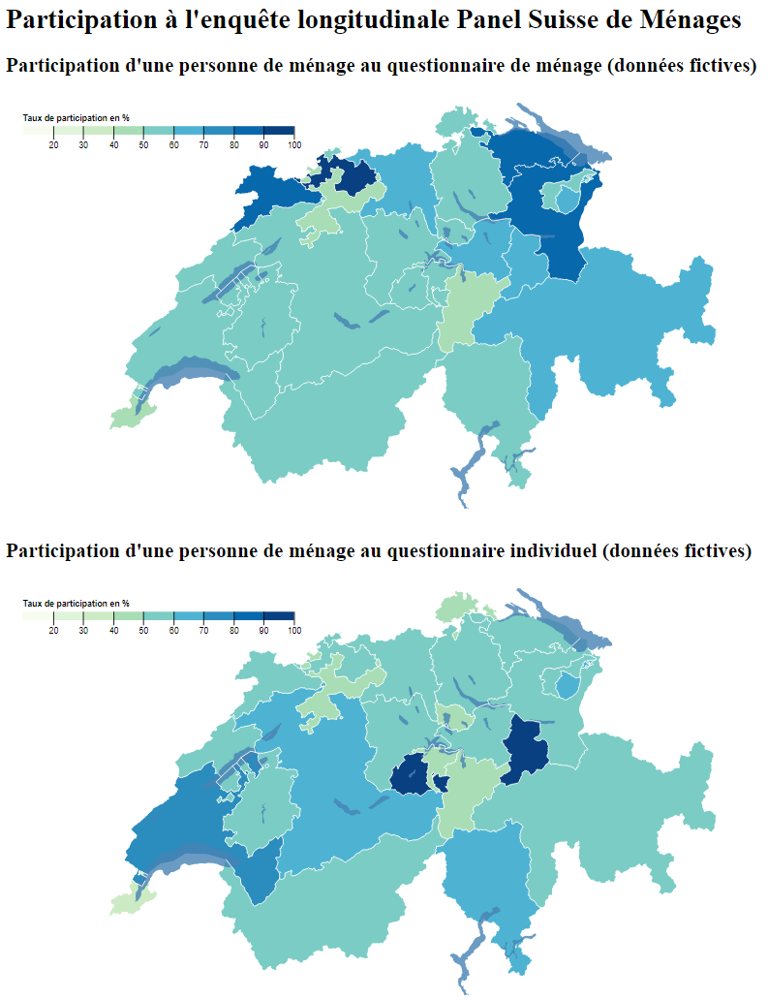
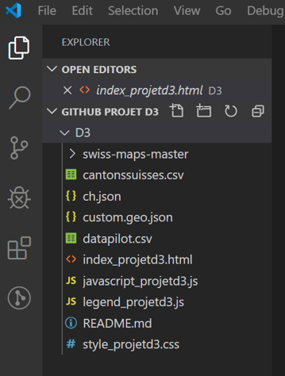

Description du projet :

Le projet D3 consiste à illustrer au travers d’une cartographie de la Suisse les données provenant de l'enquête longitudinale Panel Suisse de Ménages. Deux cartes ont été créées pour visualiser la participation d’une personne de ménage au questionnaire de ménage et au questionnaire individuel, respectivement. Les cartes permettent de naviguer sur les cantons suisses afin de voir le pourcentage de la participation pour chaque questionnaire. Cela permet ainsi à l’utilisateur de comparer des taux de participation au deux questionnaires différents. Le gradient de l’échelle de couleur utilisé sur les deux cartes se prête aussi à cette comparaison.

Capture de l’écran :

 
Procédure d’installation :

Afin de pouvoir exécuter le code :
1.	Télécharger le répertoire du https://github.com/rakeviciutem/D3
2.	A travers Visual Studio Code vous pouvez créer un espace projet avec le répertoire téléchargé. Par exemple :

3.	Ce répertoire contient tout le code nécessaire pour exécuter la page web index_projetd3.html 

Modules intégrés:

1.	Swiss-maps-master qui est la version compilée des cartes des cantons de la Suisses compatibles avec D3.js et TopoJson. 
2.	Le fichier html référence la libraire D3 et TopoJson compatibles pour la création des cartes.
3.	Les données pour les cartes proviennent du fichier datapilot.csv (Panel Suisse de Ménages, FORS, Lausanne) sont fictives.

Scripts nécessaires

1.	legend_projetd3.js
    a.	Ce fichier contient le code nécessaire pour afficher la légende des cartes avec le gradient couleur choropleth.
2.	javascript_projetd3.js
    a.	Ce fichier contient le code javascript nécessaire pour la création des cartes, l’ajout des données, des légendes.

Contexte du développement:

Ce projet a été développé dans le cadre du cours Visualisation de données dispensé par Isaac Pante (SLI, Lettres, UNIL).

Références:

- Panel Suisse de Ménages https://forscenter.ch/projects/swiss-household-panel/
- FORS https://forscenter.ch/

- JSON Suisse: https://bl.ocks.org/mbostock/raw/10024231/3ad08272674371b4a4bec221d97d7a5fbf20525e/ch.json
- Swiss Cantons & Lakes: https://bl.ocks.org/mbostock/10024231
- USA Area Choropleth: https://bl.ocks.org/mbostock/4206573
- ID cantons suisses: https://www.bfs.admin.ch/bfs/fr/home/statistiques/catalogues-banques-donnees/cartes.assetdetail.453856.html
- Téléchargement de swiss topojson: https://github.com/greenore/swiss-maps

- d3 create object without appending: https://stackoverflow.com/questions/25516078/d3-create-object-without-appending/25517076
- Adding an SVG Element: https://www.dashingd3js.com/adding-an-svg-element
- How to render [object SVGSVGElement]: https://stackoverflow.com/questions/55572033/how-to-render-object-svgsvgelement
- d3: https://github.com/d3/d3

- Echelles: https://github.com/d3/d3-scale#quantile-scales
- Choropleth Scales: https://blockbuilder.org/SpaceActuary/69e7f74035787955bcf9
- Choropleth III: https://bl.ocks.org/martgnz/56664c7ea8efef56f93ca948ef855d06

- d3-legend: https://cdnjs.com/libraries/d3-legend
- Color Legend: https://observablehq.com/@d3/color-legend
